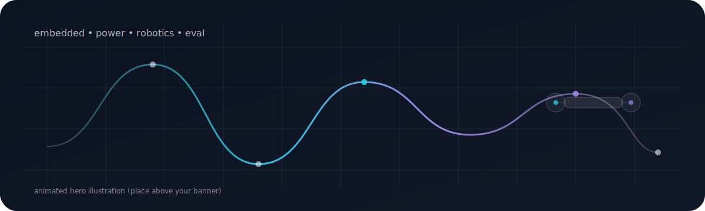

<!--
PROFILE README SETUP (must-do)
- Repo name MUST be exactly: MobinAlimohammadi
- File MUST be: MobinAlimohammadi/README.md
-->

  <!-- Put this file in your repo at: /assets/hero-anim.svg -->
  

  

---

<table>
  <tr>
    <td valign="top" width="34%">

### ⚡ Focus
- Embedded + power electronics  
- Robotics & simulation  
- Multimodal eval + benchmarking  
- Measurement-driven engineering  

    </td>
    <td valign="top" width="33%">

### 🧩 Building
- Sub-250g UAV platform (ArduPilot, custom power)  
- Drivetrain validation tooling (Python)  
- BLDC optimization + testbench workflows  
- Distributed systems experiments (UTXO / consensus)  

    </td>
    <td valign="top" width="33%">

### 🤝 Connect
- LinkedIn: **[placeholder]**  
- Email: **[placeholder]**  
- Portfolio: **[placeholder]**  

    </td>
  </tr>
</table>

---

## ✨ Highlights (quick + readable)

- **Google DeepMind — Gemini project:** structured multimodal eval datasets + internal benchmarking support  
- **Electric powertrain engineering:** HV/LV + accumulator integration + drivetrain test/validation tooling  
- **Autonomous UAV:** GPS/IMU/ESC stack + efficiency/control redesign  
- **BLDC research:** harmonic/cogging analysis + physics-informed optimization framing  
- **Shipped product:** co-founded a mobile platform scaling to **3,000+** downloads  

---

## 🧰 Toolchain (same-size brands)

  

  
  
  
  
  
  

---

## 📌 Featured (GitHub-native cards — no rate limits)

<!-- These use GitHub’s own OpenGraph images (reliable). Swap repos any time. -->

  
  

  
  

  
<b>More repos</b>

- https://github.com/MobinAlimohammadi?tab=repositories

---

## 📈 Stats (reliable)

  

  
  

---

## 🐍 Snake (auto-generated)

  <picture>
    <source media="(prefers-color-scheme: dark)" srcset="https://raw.githubusercontent.com/MobinAlimohammadi/MobinAlimohammadi/output/github-contribution-grid-snake-dark.svg" />
    
  </picture>

---

  

